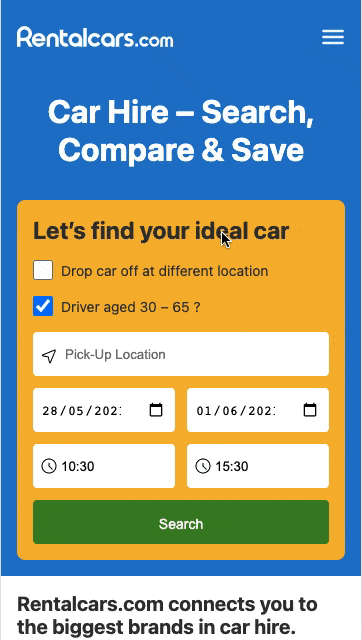
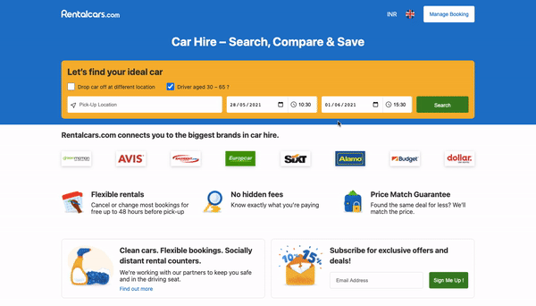

# **RentalCars Clone**

> ### Use the Rentalcars.com search endpoint to retrieve and display car hire locations based on user input.

Clone Demo — https://itsrockyy.me/rentalcars/

Original Website — https://www.rentalcars.com/

## Project Setup

This project is bootstrapped using Create React App ([CRA](https://reactjs.org/docs/create-a-new-react-app.html)).

To run this project locally —

-   Prerequisites - You need to have [Node.js](https://nodejs.org/en/download/) and [npm](https://docs.npmjs.com/) installed on your machine
-   Clone/Download this project
-   Navigate to the folder and Run the command `npm i`
-   To run the Dev Server, run `npm start` this will spin up a local dev server on [localhost:3000](localhost:3000) with HMR enabled
-   For optimised production build , run `npm run build`
-   You can serve this project from `/build` directory
-   To run the test cases, run `npm test`

## Project Folder Structure

```bash
├── build # Webpack output folder
├── package.json # Node dependencies
├── public # Public folder containing index.html
└── src # Main app code
    ├── App.js # Root Level Component
    ├── App.test.js
    ├── assets # static assets like images, svgs etc.
    ├── common # common components & helper functions
    ├── components
    │   ├── Footer # Footer
    │   ├── Header # Header & Autocomplete Search Suggestion widget
    │   ├── Main # Main Content
    │   └── index.js
    ├── index.css # Global Styles
    ├── index.js # Entry Point
```

# Mobile View



# Desktop View



# Performance Metrics

1. Lighthouse - [Report](https://lighthouse-dot-webdotdevsite.appspot.com//lh/html?url=https%3A%2F%2Fitsrockyy.me%2Frentalcars%2F)
2. Page Speed Insights - [Mobile](https://developers.google.com/speed/pagespeed/insights/?url=https%3A%2F%2Fitsrockyy.me%2Frentalcars%2F&tab=mobile) | [Desktop](https://developers.google.com/speed/pagespeed/insights/?url=https%3A%2F%2Fitsrockyy.me%2Frentalcars%2F&tab=desktop)

## Technologies Used

-   [React.js](https://reactjs.org) and [Node.js](https://nodejs.org/en/)

-   Styling — [styled-components](https://styled-components.com/)

-   Build Env & Tools — [Webpack](https://webpack.js.org/), [Babel](https://babeljs.io/), [Prettier](https://prettier.io/), [ESLint](https://eslint.org/)

-   Deployment — [Github Pages](https://pages.github.com/)

-   Testing — [React Testing Library](https://testing-library.com/docs/react-testing-library/intro/), [Jest](https://jestjs.io/)

-   Performance - [Lighthouse](https://developers.google.com/web/tools/lighthouse), [Page Speed Insights](https://developers.google.com/speed/pagespeed/insights/)

-   Accessibility - [Chrome Vox Screen Reader](https://chrome.google.com/webstore/detail/screen-reader/kgejglhpjiefppelpmljglcjbhoiplfn)

-   Search Suggestions API ([Example](https://www.rentalcars.com/FTSAutocomplete.do?solrIndex=fts_en&solrRows=6&solrTerm=search-string"))

Made with ️❤︎ by **[Abhijeet Saxena](https://itsrockyy.github.io/ 'Abhijeet Saxena')**
